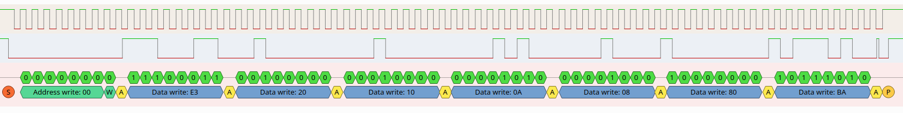
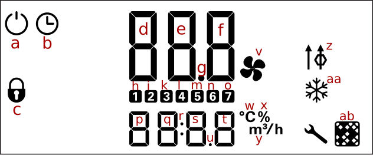
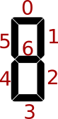
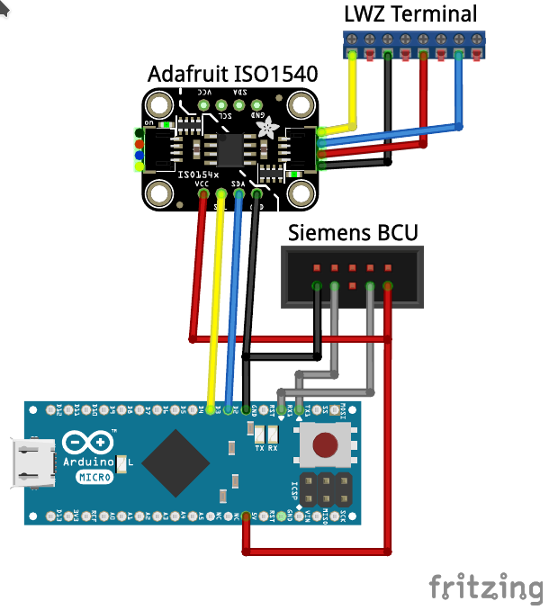

# Stiebel Eltron LWZ 180 control unit interface

Some reverse engineering to hook up an LWZ 180 unit to KNX using an Arduino Micro.

## I²C bus

According to the documentation, the LWZ180 features an I²C bus
for connecting and external control unit. It was conceivable that it is the same bus
the internal control unit already uses for communication, so eavesdropping this
should give us some information about how to get process data and how
to control the LWZ180.

Using a cheap signal analyser we can establish that the bus runs at a clock rate
of 31.25 kHz. After capturing some data we can also confirm that this is indeed
an I²C bus:



The bus is used for broadcast ("general call") write operations (address `0x00`). This makes it easy to add
arbitrary additional devices that can both listen and send data.

## Data packets

After listening for the bus for some time, we can distinguish a few different types of packets, three of which
are of particular interest (especially during startup and when changing values through the internal control unit,
more types can be seen):

* 7 bytes, starting `e3 20 10` (actual values -- individual sensor readings and settings)
* 7 bytes, starting `e3 30 20` (commands due to pressed buttons at the control unit)
* 28 bytes, starting with `f7 20` (those are updating the control unit display)

Each of the packets ends with a single byte checksum. I did not figure out how exactly it is
calculated, but for my purposes it will only be necessary to replay a small discrete set of
packets and not make up arbitrary ones on the fly.

It looks like the three bytes distinguish the type of packet and identify sender and
receiver addresses, but again, for my purpose this did not matter at all. I will call those three bytes the header,
and those between the header and the checksum are the payload.

### Actual values
These packets have a 3-byte payload. The first byte enumerates the type of reading and the remaining two bytes 
are a fixed-point decimal stored in a big-endian signed (using two's complement) word. The scaling factor depends
on the type of reading:

|type|scaling|value                                |unit|
|----|-------|:------------------------------------|----|
|0x00|0.1    |I13 (dew point extract air)          |°C  |
|0x01|0.1    |I14 (dew point outdoor air)          |°C  |
|0x06|0.1    |I9 (temperature outdoor air)         |°C  |
|0x07|0.1    |I10 (temperature supply air)         |°C  |
|0x08|0.1    |I2 (temperature extract air)         |°C  |
|0x09|0.1    |I11 (temperature exhaust air)        |°C  |
|0x0e|0.1    |I12 (rel. humidity outdoor air)      |%   |
|0x0f|0.1    |I3 (rel. humidity extract air)       |%   |
|0x10|1      |I16 (suuply air flow, calculated)    |m³/h|
|0x11|1      |I18 (exhaust air flow, calculated)   |m³/h|
|0x14|0.1    |I15 (drive power supply air fan)     |%   |
|0x15|0.1    |I17 (drive power exhaust air fan)    |%   |
|0x1e|1      |P6                                   |m³/h|
|0x1f|1      |P7                                   |m³/h|
|0x20|1      |P8                                   |m³/h|
|0x21|1      |P9                                   |m³/h|
|0x50|1      |I21 (fan operating time)             |d   |
|0x51|1      |I20 (ventilation unit operating time)|d   |
|0x5a|1      |I4 (filter service life)             |h   |
|0x4d|1      |P10                                  |Pa  |
|0x53|1      |P11                                  |Pa  |
|0x54|1      |P12                                  |Pa  |
|0x55|1      |P13                                  |Pa  |

I could also see a few other types (`0x02`, `0x05`, `0x0d`, `0x0a`, `0x0b`, `0x0c`, `0x69`, `0x6d`, `0x12`, `0x13`, 
`0x3b`), but could not attribute them with certainty to specific values.
There are also `0x12` and `0x13`, which look like preassure values (inside and outside), but I could not confirm this, yet.

### Buttons
In only the last byte of the payload differs from zero. The values have the following meaning:

|payload|button                         |
|-------|:------------------------------|
|1      |down (wheel)                   |
|2      |up (wheel)                     |
|5      |menu                           |
|6      |ok                             |
|7      |home                           |
|8      |power vent                     |
|9      |menu (long)                    |
|10     |ok (long)                      |
|11     |home (long)                    |
|12     |power vent (long)              |
|13     |cleaning lock: home + ok (long)|

Wheel up/down is only accepted if sent in pairs in short succession.


### Display updates
These packets reveal that the control unit is just a dumb display with buttons, not containing any actual
logic. Every bit in these packets simply turns on certain portions of the display:



|byte|bit|display element            |
|----|---|---------------------------|
|3   |   | d (first line, 1st digit) |
|4   |   | e (first line, 2nd digit) |
|5   |   | f (first line, 3rd digit) |
|6   |   | p (second line, 1st digit)|
|7   |   | q (second line, 2nd digit)|
|8   |   | s (second line, 3rd digit)|
|9   |   | t (second line, 4th digit)|
|12  | 0 | b (clock)                 |
|    | 2 | a (power)                 |
|    | 4 | o (7)                     |
|    | 6 | n (6)                     |
|13  | 0 | m (5)                     |
|    | 2 | l (4)                     |
|    | 4 | k (3)                     |
|    | 6 | i (2)                     |
|15  | 2 | c (lock)                  |
|16  | 4 | v (fan)                   |
|17  | 2 | g (decimal dot on first)  |
|18  | 2 | y (m³/h)                  |
|    | 6 | x (%)                     |
|20  | 0 | ab (filter)               |
|    | 6 | aa (freezing)             |
|21  | 2 | z (bypass)                |
|23  | 0 | power vent LED            |

`h` ("1") is somehow derived from other bits and there are also a few which indicate blinking elements
(used to show the input "cursor").

Each of the seven digits is represented by a seven-segment display, with each bit addressing a single segment:



These segments are combined to create the following characters:

|payload byte|character|
|------------|---------|
|0x00        |         |
|0x06        | 1       |
|0x07        | 7       |
|0x1c        | u       |
|0x30        | I       |
|0x39        | C       |
|0x3f        | 0       |
|0x40        | -       |
|0x4f        | 3       |
|0x50        | r       |
|0x5b        | 2       |
|0x5c        | o       |
|0x5e        | d       |
|0x66        | 4       |
|0x6d        | 5       |
|0x6f        | 9       |
|0x73        | P       |
|0x77        | A       |
|0x78        | t       |
|0x7d        | 6       |
|0x7f        | 8       |

There are some display elements I have not encountered (inlet air heating, errors) and there are some not used
by the LWZ 180 at all (as those elements are missing in the documentation). They can be seen briefly during startup:


## Arduino sketch
I am using an Arduino Micro, as it has hardware I²C support and two UARTs (one for the KNX bus and one for
debugging via USB). As it runs with 5V, it can be directly powered by the Siemens BCU.
It uses the [KnxTpUart](https://github.com/thorsten-gehrig/arduino-tpuart-knx-user-forum) library to interface with the KNX bus
via the Siemens BCU.

[lwz180.ino](lwz180.ino)


## Wiring
In order to isolate the KNX bus from the LWZ's I²C bus, I threw in an ISO1540 isolator (Adafruit offeres a small breakout board, which makes this very painless). Should I decide to
switch the Arduino Micro for a 3.3V SOC, the isolator will also come in handy as it can be used with different
voltages on both ends, acting as a level converter.

Communication with the KNX bus goes through the UART of a Siemens 5WG1117-2AB12 BCU.



Once installed, updates from I²C are sent to the KNX bus. I am internally distributing KNX messages via MQTT to other consumers, which makes it easy to listen to the LWZ 180 update messages anywhere on the network:
```
> mosquitto_sub -v -t knx/5/7/#
knx/5/7/4 210.08
knx/5/7/11 3
knx/5/7/4 211.04
knx/5/7/11 3
knx/5/7/4 208.96
knx/5/7/11 3
knx/5/7/4 207.04
knx/5/7/3 2.5
knx/5/7/11 3
knx/5/7/5 38.7
```
